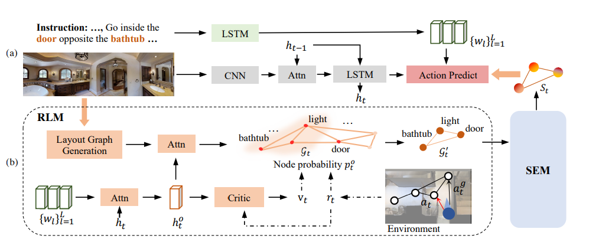

# SEvol
Code for our CVPR 2021 paper "[Reinforced Structured State-Evolution for Vision-Language Navigation](https://openaccess.thecvf.com/content/CVPR2022/html/Chen_Reinforced_Structured_State-Evolution_for_Vision-Language_Navigation_CVPR_2022_paper.html)".

Contributed by [Jinyu Chen](https://scholar.google.com/citations?hl=zh-CN&user=9v4HaLEAAAAJ), [Chen Gao](http://chengaopro.github.io/), Erli Meng, Qiong Zhang, [Si Liu](https://scholar.google.com/citations?user=-QtVtNEAAAAJ&hl=zh-CN&oi=ao)



## Getting Started
### Installation
1. Install the Matterport3D simulators, please follow the intructions [here](https://github.com/peteanderson80/Matterport3DSimulator).

1. Clone this repository.

    ~~~
    cd Matterport3DSimulator && mkdir methods && cd methods
    git clone https://github.com/chenjinyubuaa/SEvol.git
    ~~~

3. Install the requirements.
    ~~~
    pip install -r requirements.txt
    ~~~

## Training and Test
### Dataset Preparation

Please download the data and pretrained checkpoints from [here](https://drive.google.com/file/d/1DTjIUJQbCPThQui-xJQqFJ8stj5_4Ze7/view?usp=sharing). put the `img_features` and `task` directory under the `Matterport3DSimulator` directory.
### Training

Following [Speaker-follower](https://github.com/ronghanghu/speaker_follower) and [EnvDrop](https://github.com/airsplay/R2R-EnvDrop), we train our model on R2R as follows:

1. Train the `speaker` model under the Matterport3DSimulator:
~~~
    bash methods/SEvol/run/train_speaker.sh 0
~~~

2. Train the `follower` model:
~~~
    bash methods/SEvol/run/train_r2r.sh 0
~~~
3. train with the back translation data augmentation:
~~~
    bash methods/SEvol/run/train_r2r_bt.sh 0
~~~
We use the speaker model with best bleu and the follower model with the best SR on val-unseen split for the 3rd stage training
### Test
1. Use the valid.sh to test the checkpoints. Just change the checkpoint path in it

    ```
    bash methods/SEvol/run/valid.sh 0
    ```

## Citation
Please consider citing this project in your publications if it helps your research. The following is a BibTeX reference. The BibTeX entry requires the url LaTeX package.

~~~
@InProceedings{Chen_2022_CVPR,
    author    = {Chen, Jinyu and Gao, Chen and Meng, Erli and Zhang, Qiong and Liu, Si},
    title     = {Reinforced Structured State-Evolution for Vision-Language Navigation},
    booktitle = {Proceedings of the IEEE/CVF Conference on Computer Vision and Pattern Recognition (CVPR)},
    month     = {June},
    year      = {2022},
    pages     = {15450-15459}
}
~~~
## License
CKR-nav is released under the MIT license. See [LICENSE](LICENSE) for additional details.
## Acknowledge
Some of the codes are built upon [NvEM](https://github.com/MarSaKi/NvEM) and [EnvDrop](https://github.com/airsplay/R2R-EnvDrop). Thanks them for their great works!
